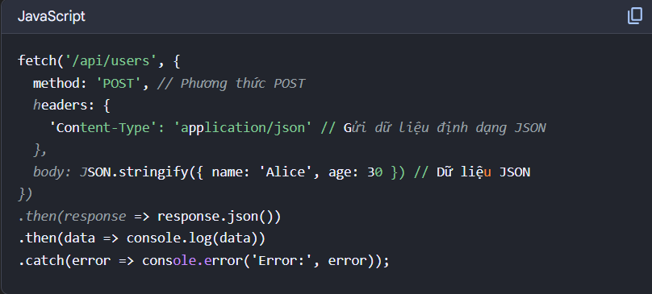

## Câu hỏi buổi 2

#### 1. Vì sao ở lần chạy đầu tiên hàm Set ko chạy


- Hàm set tại thời điểm đó chưa làm thay đổi giá trị mail lúc đó, mà nó sẽ cập nhật giá trị mail ở lần render tiếp theo

#### 2. Strictmode là gì và tại sao lại sử dụng Strictmode

    - Strictmode là 1 quy chuẩn nghiêm khắc ở javascript
    - Strictmode được tạo ra để ngăn chặn sử dụng và throw error khi người lập trình thực hiện những xử lý được coi là unsafe; vô hiệu hóa
        các tính năng có thể gây nhầm lẫn hoặc không nên sử dụng, ngăn chặn sử dụng một số từ có thể là keyword trong tương lai
    - React: StrictMode là một công cụ để làm nổi bật các vấn đề tiềm ẩn trong một ứng dụng. Giống như Fragment, StrictMode không render bất kỳ giao diện nào. Nó kích hoạt các kiểm tra mở rộng và cảnh báo bổ sung cho các component con.


[Tham khảo StrịctMode](https://vi.legacy.reactjs.org/docs/strict-mode.html)

#### 3. How to component con truyền dữ liệu lên component cha

    - Vì reactjs chỉ có truyền data one-way chỉ 1 đường truyền data từ cha tới con thông qua props, nên muốn con có thể truyền dữ liệu lên cha thì từ cha phải truyền 1 callback function tới component con, mục đích của callback function này là để component con có thể thay đổi một phần state của component cha
    - con có thể truyền dữ liệu lên cha thông qua state = callback function

#### 4. 7 layers trong feature-sliced design là gì? Và làm sao để áp dụng vào dự án hiện tại của bạn?

- App:
- Processes(deprecated)
- Pages
- Widgets
- Features
- Entities
- Shared
  

#### 5. Tại sao sử dụng axios mà k dùng fetch . ưu và nhược điểm axios

- Axios là một thưu viện của js hỗ trợ để tạo request HTTP
- Ưu điểm:
  User truyền data vào request hay nhận data từ response thì data luôn tự động convert., do đó không cần phải thêm các method khác.
  Việc xử lý lỗi rất dễ dàng vì Axios cho phép bắn lỗi network. Nếu đó là một bad response như 404, promise sẽ được bỏ qua và sẽ trả về một error. Do đó, ta cần catch error đấy.
  Hỗ trợ promise API
  Hỗ trợ interceptors: thực hiện các tác vụ như thêm tiêu đề, xử lý lỗi, thêm hoặc xóa thông tin từ yêu cầu và phản hồi, và nhiều tác vụ khác.

#### 6. Các loại storage trong trình duyệt, khái niệm và cách sử dụng

- Local storage:
  - Khả năng lưu trữ vô thời hạn: chỉ bị xóa bằng js, xóa bằng bộ nhớ trình duyệt hoặc xóa bằng localStorageAPI
  - Không gửi thông tin lên server như COOKIE nên bảo mật hơn
- Session Storage :
  - Lưu trữ trên client: cũng giống như local storage thì session storage cũng dùng để lưu trữ dữ liệu trên trình duyệt của khách truy cập
  - Mất dữ liệu khi đóng tab
  - Dữ liệu không được gửi lên server
  - Thông tin lưu trữ nhiều hơn cookie
- Cookie
  - Thông tin được gửi lên server
  - Cookie là chủ yếu đọc ở máy chủ, localStorage và SessionStorage đọc ở máy khách
  - Có thời gian sống: thời gian timeout nhất định do dev quy định

#### 7. UseEffect

- Nếu k có dependencies thì useEffect chạy lại sau mỗi lần render của component
- dependencies
  - array rỗng [] => chỉ chạy một lần khi mount
  - có dependencies=> chạy lại khi một trong các dependencies thay đổi
    
  - Trường hợp này chạy vì khi component được re-render thì callbackexample sẽ là 1 hàm mới =>useEffect chạy lại

#### 8. useState

- Hook để quản lý state, state là dữ liệu có thể thay đổi theo thời gian, khi state thay đổi React sẽ render lại component chứa state đó và component con
- Khi sử dụng giá trị state, react dùng giá trị đó để render lại component, giá trị state được cập nhật tự động
- Khi gọi hàm setState thì react k cập nhật ngay lập tức mà đánh dấu cần render lại, sau đó react render lại component với giá trị state mới
- khai báo useState ở đầu component, k đặt trong if, for, function

#### init? trong fetch


- Dùng init khi muốn tùy chỉnh cách gửi request, cần gửi thêm dữ liệu, header/token
  

#### Commit lên browser và render

app-> render-> dom ảo-> commit -> dom thật-> browser

#### useCallback

- useCallBack(fn, dependencies)
  => fn ko chạy lại khi component bị render

#### Memo


#### useMemo va Memo

Khac nhau
useMemo(fn, deps) ghi nhớ giá trị trả về của fn bên trong một component để tránh tính lại tốn kém khi deps không đổi.

React.memo(Component, areEqual?) ghi nhớ kết quả render của một component con; nếu props không đổi (so bởi areEqual), component con không re-render.
Ví dụ

```html
import React, { useMemo, useState } from "react";

// Child đắt -> bọc React.memo
const Row = React.memo(function Row({ item }: { item: { id: number; name: string } }) {
  console.log("Render Row", item.id);
  return <li>{item.name}</li>;
});

export default function DemoList() {
  const [keyword, setKeyword] = useState("");
  const [count, setCount] = useState(0);

  const data = useMemo(
    () => Array.from({ length: 5000 }, (_, i) => ({ id: i + 1, name: `Item ${i + 1}` })),
    []
  );

  // Lọc dữ liệu tốn kém -> useMemo để không filter lại khi 'count' đổi
  const filtered = useMemo(() => {
    const lower = keyword.toLowerCase();
    return data.filter((it) => it.name.toLowerCase().includes(lower));
  }, [data, keyword]);

  return (
    <div>
      <input value={keyword} onChange={(e) => setKeyword(e.target.value)} placeholder="Search..." />
      <button onClick={() => setCount((c) => c + 1)}>Increase count ({count})</button>
      <ul>
        {filtered.map((it) => (
          <Row key={it.id} item={it} />
        ))}
      </ul>
    </div>
  );
}

```
### cookie
Session Cookie
Được lưu tạm thời trong bộ nhớ máy tính trong lúc bạn đang truy cập Website đó và sẽ tự động xóa khi bạn đóng trình duyệt, bạn sẽ rất dễ dàng bắt gặp những Session Cookie này khi đang truy cập Website và máy hết pin tắt đột ngột, bạn có thể mở máy tính lên, trình duyệt sẽ tự động hỏi bạn có muốn load lại những trang mà bạn đã từng truy cập lúc nãy không.

Persistent Cookie
Được lưu trên ổ cứng máy tính và không bị xóa khi bạn đóng trình duyệt. Bạn có thể thấy loại Cookie này khi bạn quay trở lại một trang web nào đó và thông tin đăng nhập của bạn vẫn còn sẵn, không bị mất đi.